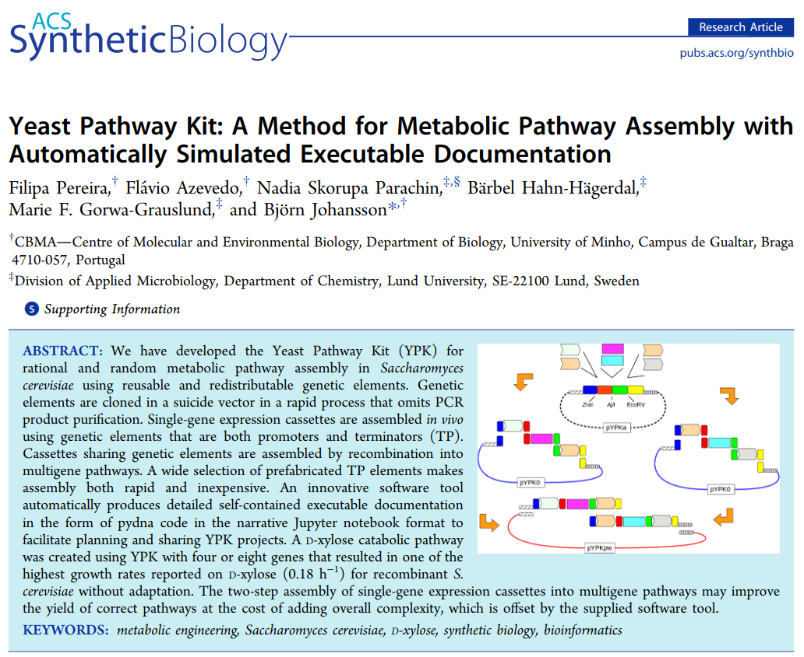
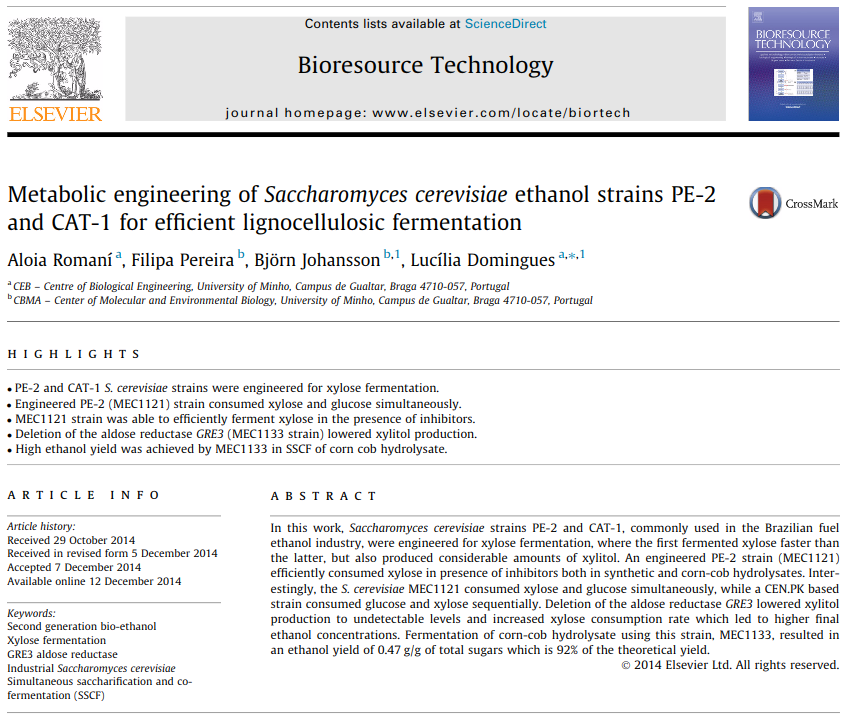

# Pereira et al. 2016

This repository contains Jupyter notebooks describing cloning using
[Python](https://www.python.org),
[Jupyter notebooks](https://jupyter.org) and
[pydna](https://github.com/BjornFJohansson/pydna).

The notebooks and other files in this repository accompany the publications:

Pereira, F., Azevedo, F., Parachin, N. S., Hahn-Hägerdal, B., Gorwa-Grauslund, M. F., & Johansson, B. (2016). Yeast Pathway Kit: A Method for Metabolic Pathway Assembly with Automatically Simulated Executable Documentation. ACS Synthetic Biology, 5(5), 386–394.
[PubMed](https://pubmed.ncbi.nlm.nih.gov/26916955)
[website](https://pubs.acs.org/doi/abs/10.1021/acssynbio.5b00250)

and

Romaní, A., Pereira, F., Johansson, B., & Domingues, L. (2015). Metabolic engineering of Saccharomyces cerevisiae ethanol strains PE-2 and CAT-1 for efficient lignocellulosic fermentation. Bioresource Technology, 179, 150–158.
[PubMed](https://www.ncbi.nlm.nih.gov/pubmed/25536512)
[website](https://www.sciencedirect.com/science/article/abs/pii/S096085241401757X)

The notebooks can be visualized in a number of ways.
Each notebook (.ipynb) is accompanied by a HTML file with the same name but with an (.html)
extension. These can be opened in a web browser without installing any software.

The notebooks (.ipynb) can be opened in the browser through the nbviewer service
[here](https://nbviewer.jupyter.org/github/MetabolicEngineeringGroupCBMA/ypk-xylose-pathways/blob/master/notebooks/index.ipynb)
or directly in Github [here](notebooks/index.ipynb).

## Significant files

Most files have either a .ipynb or .gb extension. The .ipynb files
are [Jupyter notebooks](http://jupyter.org) and .gb files
are [genbank formatted](http://quma.cdb.riken.jp/help/gbHelp.html) text files.

[index](notebooks/index.ipynb)

The index.ipynb notebook is the place to start as it has links to the other notebooks.

Each notebook contain links (usually in the end) to the resulting sequences in Genbank flat file format.

These notebooks are tested on the github action build service.

This means that the notebook outputs are re-executed and compared with saved
results once per week to ensure [reproducibility](https://en.wikipedia.org/wiki/Replication_crisis).

If the badge below is green, all tests gave the expected results.

