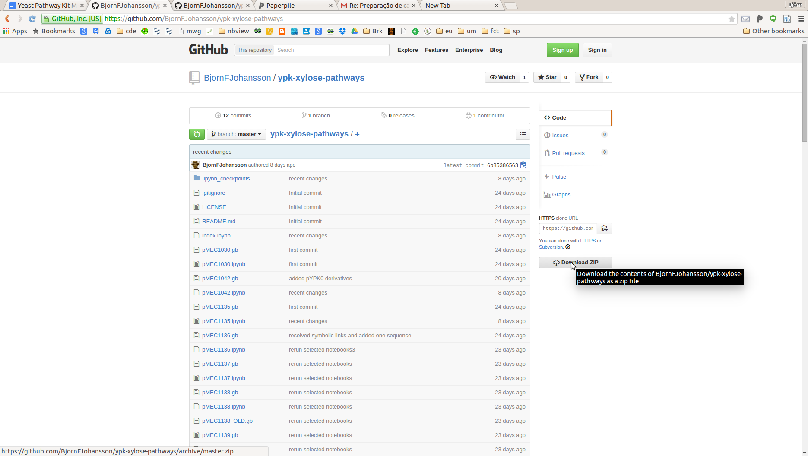

# Xylose pathway constructs described in Pereira et al. 2015

This repository contains Jupyter notebook files describing metabolic pathways
for Saccharomyces cerevisiae D-xylose utilization made using the Yeast Pathway Kit.

#[index notebook](http://nbviewer.ipython.org/github/BjornFJohansson/ypk-xylose-pathways/blob/master/index.ipynb)

If you would like to have your own copy of this pathway repository, the best way is the get a 
Github account and then make your own fork. If you would like to download all files to your 
computer, follow the instructions at the end of this page.

Click on the "Download ZIP" button to download pathway files and supplementary data as a zip archive. The button is located 
at the right side on the top of this page (see below).

